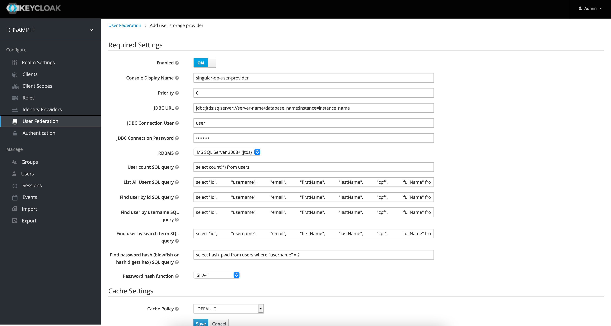
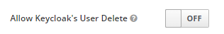
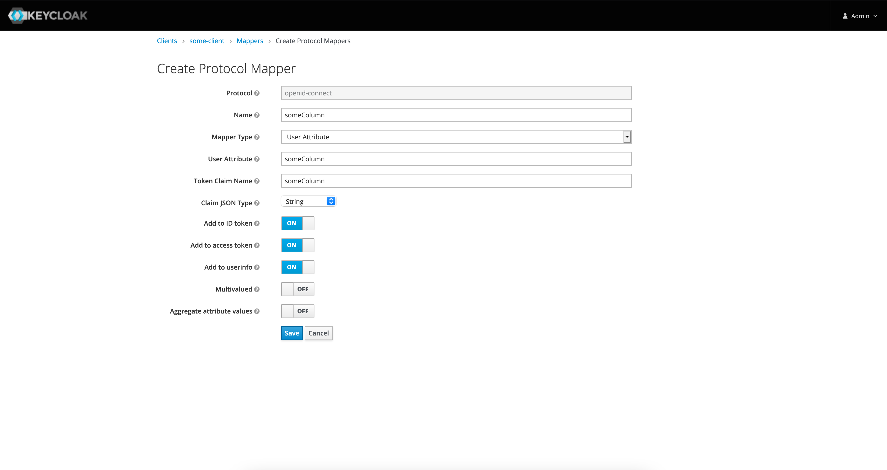

# singular-keycloak-database-federation

### Compatible with Keycloak 17+ quarkus based.

### ** Keycloak 19+ ** KNOWN ISSUE:

#### New Theme breaks custom providers, to overcome this problem, follow these steps:

 - Click "Realm Settings" on the left menu
 - Then click the tab "Themes"
 - And, for the selection input labeled "Admin console theme", select "keycloak"
 - Logoff and login again
 - Now, if you try to configure this provider again, keycloak should render all configuration fields and everything else should work fine.
 
 See issue #19 for further information.

**For older versions look at older_versions branch.

Keycloak User Storage SPI for Relational Databases (Keycloak User Federation, supports postgresql, mysql, oracle and mysql).

- Keycloak User federation provider with SQL
- Keycloak User federation using existing database
- Keycloak  database user provider
- Keycloak MSSQL Database Integration 
- Keycloak SQL Server Database Integration 
- Keycloak Oracle Database Integration 
- Keycloak Postgres Database Integration 
- Keycloak blowfish bcrypt support

## Usage

    Fully compatible with Singular Studio NOCODE. See https://www.studio.opensingular.com/
    

## Configuration

Keycloak User Federation Screen Shot

There is a new configuration that allows keycloak to remove a user entry from its local database (this option has no effect on the source database). It can be useful when you need to reload user data.
This option can be configured by the following switch:

## Limitations

    - Do not allow user information update, including password update
    - Do not supports user roles our groups

## Custom attributes

Just add a mapper to client mappers with the same name as the returned column alias in your queries.Use mapper type "User Attribute". See the example below:
    

## Build

    - mvn clean package

## Deployment

    1) Copy every  `.jar` from dist/ folder  to  /providers folder under your keycloak installation root. 
        - i.e, on a default keycloak setup, copy all  `.jar` files to <keycloak_root_dir>/providers
    2) run :
        $ ./bin/kc.sh start-dev
    OR if you are using a production configuration:
        $ ./bin/kc.sh build
        $ ./bin/kc.sh start

## For futher information see:
    - https://github.com/keycloak/keycloak/issues/9833
    - https://www.keycloak.org/docs/latest/server_development/#packaging-and-deployment
    
    

